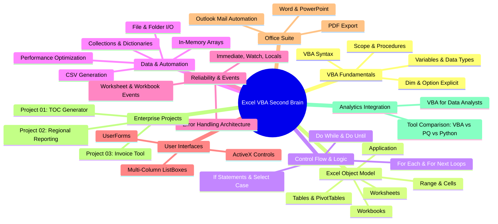

# 🌐 Visual Knowledge Map

```mermaid
mindmap
  root((Excel VBA Second Brain))
    VBA Fundamentals
      VBA Syntax
      Variables & Data Types
      Dim & Option Explicit
      Scope & Procedures
    Excel Object Model
      Application
      Workbooks
      Worksheets
      Range & Cells
      Tables & PivotTables
    Control Flow & Logic
      If Statements & Select Case
      For Each & For Next Loops
      Do While & Do Until
    Data & Automation
      In-Memory Arrays
      Collections & Dictionaries
      File & Folder I/O
      CSV Generation
      Performance Optimization
    Reliability & Events
      Immediate, Watch, Locals
      Error Handling Architecture
      Worksheet & Workbook Events
    User Interfaces
      UserForms
      Multi-Column ListBoxes
      ActiveX Controls
    Office Suite
      Outlook Mail Automation
      PDF Export
      Word & PowerPoint
    Enterprise Projects
      Project 01: TOC Generator
      Project 02: Regional Reporting
      Project 03: Invoice Tool
    Analytics Integration
      VBA for Data Analysts
      Tool Comparison: VBA vs PQ vs Python
```
