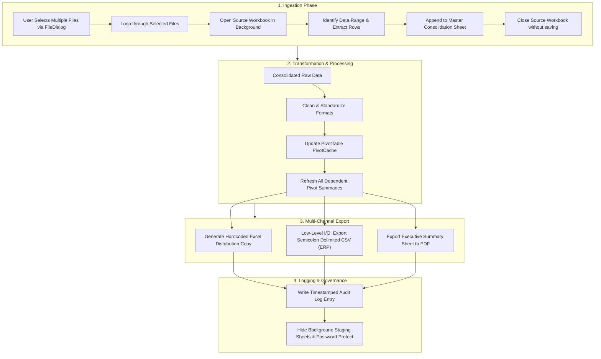

# Project 02: Architecture & ETL Pipeline Flow

```mermaid
flowchart TD
    subgraph Ingestion["1. Ingestion Phase"]
        A[User Selects Multiple Files via FileDialog] --> B[Loop through Selected Files]
        B --> C[Open Source Workbook in Background]
        C --> D[Identify Data Range & Extract Rows]
        D --> E[Append to Master Consolidation Sheet]
        E --> F[Close Source Workbook without saving]
    end

    subgraph Transformation["2. Transformation & Processing"]
        G[Consolidated Raw Data] --> H[Clean & Standardize Formats]
        H --> I[Update PivotTable PivotCache]
        I --> J[Refresh All Dependent Pivot Summaries]
    end

    subgraph Export["3. Multi-Channel Export"]
        J --> K["Generate Hardcoded Excel Distribution Copy"]
        J --> L["Low-Level I/O: Export Semicolon Delimited CSV (ERP)"]
        J --> M["Export Executive Summary Sheet to PDF"]
    end

    subgraph Audit["4. Logging & Governance"]
        K --> N[Write Timestamped Audit Log Entry]
        L --> N
        M --> N
        N --> O[Hide Background Staging Sheets & Password Protect]
    end

    Ingestion --> Transformation
    Transformation --> Export
```
