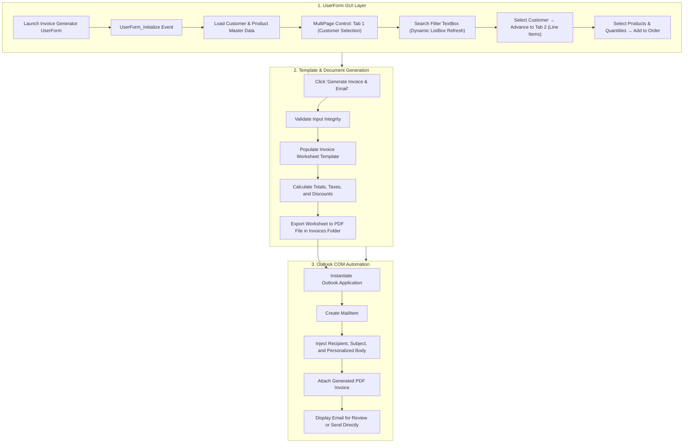

# Project 03: Application Architecture & Flow

```mermaid
flowchart TD
    subgraph UI["1. UserForm GUI Layer"]
        A[Launch Invoice Generator UserForm] --> B[UserForm_Initialize Event]
        B --> C[Load Customer & Product Master Data]
        C --> D["MultiPage Control: Tab 1 (Customer Selection)"]
        D --> E["Search Filter TextBox (Dynamic ListBox Refresh)"]
        E --> F["Select Customer → Advance to Tab 2 (Line Items)"]
        F --> G["Select Products & Quantities → Add to Order"]
    end

    subgraph Generation["2. Template & Document Generation"]
        H[Click 'Generate Invoice & Email'] --> I[Validate Input Integrity]
        I --> J[Populate Invoice Worksheet Template]
        J --> K[Calculate Totals, Taxes, and Discounts]
        K --> L[Export Worksheet to PDF File in Invoices Folder]
    end

    subgraph Distribution["3. Outlook COM Automation"]
        L --> M[Instantiate Outlook.Application]
        M --> N[Create MailItem]
        N --> O[Inject Recipient, Subject, and Personalized Body]
        O --> P[Attach Generated PDF Invoice]
        P --> Q[Display Email for Review or Send Directly]
    end

    UI --> Generation
    Generation --> Distribution
```
